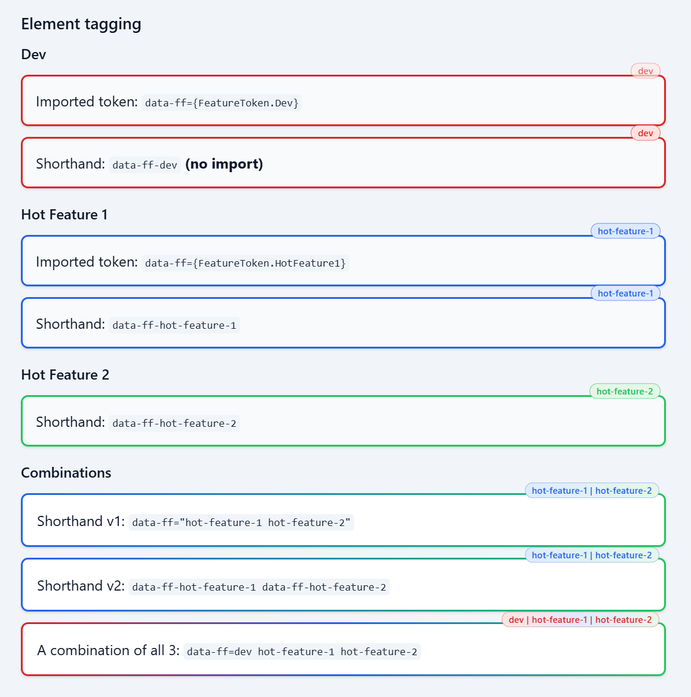
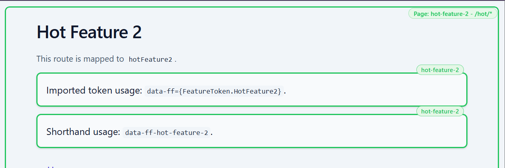

# @at-flux/astro-feature-flags

[](https://www.npmjs.com/package/@at-flux/astro-feature-flags)
[](https://github.com/at-flux/astroflare/actions/workflows/ci.yml)
[](https://opensource.org/licenses/MIT)

<p align="center">
  
  
  <br/>
  
</p>

Feature flags for Astro with a declarative config:

- per-flag declaration (`colour`/`color` for dev-toolbar chrome, optional `routes` for matching pages)
- **Astro dev vs `dev` layer (default):** **`isAstroDev`** is `import.meta.env.DEV` from Astro/Vite. The reserved **`dev` environment** is injected for you with `when: mode !== "production"` (same `mode` as the integration, defaulting to `NODE_ENV`). When that layer is active, all declared flags resolve **on** at build/SSR and process-env overrides are skipped; the dev toolbar only changes client preview. **`runtime.isDev`** is `activeEnvironment === "dev"` — it matches **`isAstroDev`** in the usual setup (`astro dev` + non-production `mode`). They differ only if you pin another layer with **`forceEnvironment`** / **`AFF_ENVIRONMENT`** while still running the dev server.
- **At least one non-`dev` layer** in your config (`prod`, `staging`, …); you do **not** declare the reserved `dev` key — it is merged automatically. Exactly one `when: true` among layers (for that `mode`) unless you pin a layer.
- element gating via namespaced attributes (`data-ff` or `data-ff-<token>` by default)
- production static HTML: gated `data-ff` nodes culled, dev-only CSS not shipped (`featureFlagStyles` is empty); `data-ff-route*` stripped from `<html>`
- route badge + production route pruning
- dev toolbar for enabled/outline/badge/colour preview (when a URL would be pruned for a configured layer, the overlay names **environment keys**, not `NODE_ENV` text)

## Terminology (short)

| Term | Meaning |
| ---- | ------- |
| **Astro dev** | `astro dev` or `import.meta.env.DEV` → `isAstroDev`. |
| **`dev` environment** | Reserved layer (auto-injected): all declared flags resolve **on**; no `AFF_FEATURE_*` / `ASTRO_FEATURE_FLAGS` overrides. Default `when` follows `mode !== "production"` (same idea as local `astro dev`). |
| **Non-`dev` layer** | Any key you declare (`prod`, `staging`, …): uses `environments.<key>.flags` booleans. |

## Quickstart

1. Configure in `astro.config.mjs`:

   ```js
   import astroFeatureFlags from "@at-flux/astro-feature-flags";

   export default defineConfig({
     integrations: [
       astroFeatureFlags({
         // optional: jsonConfigPath: "./ff.json",
         // optional: configRoot: fileURLToPath(new URL(".", import.meta.url)),
         flags: {
           wip: {
             colour: "rgb(220 38 38)",
             routes: ["/blog/*"],
           },
           hotFeature1: {
             colour: "rgb(37 99 235)",
             routes: ["/hot-feature-1/*"],
           },
           hotFeature2: {
             colour: "rgb(34 197 94)",
             outline: false,
             badge: true,
             routes: ["/hot/*", "/hot-dev/*"],
           },
         },
         environments: {
           // Reserved `dev` is injected for you. Declare non-dev layers only.
           // Exactly one `when: true` for this `mode` unless you use forceEnvironment / AFF_ENVIRONMENT.
           prod: {
             when: process.env.NODE_ENV === "production",
             flags: {
               wip: false,
               hotFeature1: true,
               hotFeature2: false,
             },
           },
         },
       }),
     ],
   });
   ```

2. Optional JSON: **`jsonConfigPath`** on the integration root (merged after inline config). Optional **`jsonConfigPath`** on each **non-`dev`** environment merges when that layer is active (after the root file). Paths resolve relative to `configRoot` (`process.cwd()` by default).

   ```json
   {
     "environments": {
       "prod": {
         "flags": { "hotFeature1": false }
       }
     }
   }
   ```

3. Gate elements in markup:
   - `data-ff={FeatureToken.HotFeature2}`
   - `data-ff={[FeatureToken.Wip, FeatureToken.HotFeature2].join(' ')}`
   - `data-ff="wip hot-feature-2"` **(no import!)**
   - `data-ff-wip` **(no import!)**
   - `data-ff-hot-feature-2` **(no import!)**

> [!NOTE]
> Flags are combinatory. If an element has `data-ff="wip hot-feature-2"`, both flags must be enabled for SSR outside the reserved `dev` layer.
> In **`dev`**, all declared flags are on at resolve time; the dev toolbar only changes client preview. In **non-dev** builds, nodes that fail the check are **removed from the HTML**. Prefer **`shouldRenderFeature`** when you need compile-time omission with no trace in `dist/`.

## Common Use Cases

### 1) Per-element token (imported)

```tsx
---
import { FeatureToken } from 'virtual:astro-feature-flags';
---

<section data-ff={FeatureToken.Wip}>WIP section</section>
<aside data-ff={FeatureToken.HotFeature2}>Hot section</aside>
```

You can also use flag names in `data-ff`:

```tsx
---
import { FeatureFlag } from 'virtual:astro-feature-flags';
---

<aside data-ff={FeatureFlag.HotFeature2}>Hot section</aside>
```

### 2) Shorthand attribute (no import)

```tsx
<section data-ff-wip>WIP section</section>
<aside data-ff-hot-feature-2>Hot section</aside>
```

`data-ff-wip` is equivalent to `data-ff={FeatureToken.Wip}` or `data-ff="wip"`.

If `tokenNamespace` is `aff`, use `data-aff` / `data-aff-<token>` instead.

### 2b) Combined flags (AND behavior)

Both flags must be enabled:

```tsx
<div data-ff-wip data-ff-hot-feature-2>
  ...
</div>
```

Or using `data-ff` with values:

```tsx
---
import { FeatureFlag } from 'virtual:astro-feature-flags';
---

<div data-ff={[FeatureFlag.Wip, FeatureFlag.HotFeature2].join(' ')}>...</div>
// OR
<div data-ff="wip hot-feature-2">...</div>
```

`data-ff` expects a space-separated list of feature flags.

### 3) Dev toolbar chrome (automatic)

On **`astro dev`**, when the active layer is the reserved **`dev`** environment, the integration uses Astro’s **`injectScript('head-inline', …)`** to append dev-only CSS, set **`data-ff-route`** on `<html>` from the current URL (including after **`astro:page-load`** / **`astro:after-swap`**), and run the toolbar bootstrap script. You do **not** need to wire `affDevBootstrap`, `featureFlagStyles`, or `data-ff-route` in a root layout unless you intentionally want a second copy.

The virtual module still exports **`affDevBootstrap`**, **`featureFlagStyles`**, and **`routeFeatureTokensForPath`** for advanced layouts.

### 4) Logic usage (`FeatureFlag`)

Use this when you need explicit conditional logic in frontmatter (most UI cases can stay markup-only with `data-ff-*`):

```ts
import { FeatureFlag, shouldRenderFeature } from "virtual:astro-feature-flags";
```

`shouldRenderFeature()` and `isFeatureEnabled()` follow config/env values.\
The dev toolbar changes client-side preview state only.

## Configuration Schema

### Top-level options

| Option             | Type                                | Default         | Notes                                                                 |
| ------------------ | ----------------------------------- | --------------- | --------------------------------------------------------------------- |
| `configRoot`       | `string`                            | `process.cwd()` | Resolves relative `jsonConfigPath` values (root + per-environment).   |
| `jsonConfigPath`   | `string`                            | unset           | Root JSON only; merged after inline config (not per-environment).   |
| `forceEnvironment` | `string`                          | unset           | Pin the active layer (skips `when` / `AFF_ENVIRONMENT` validation).   |
| `mode`             | `string`                            | `NODE_ENV`      | Stored on the resolved runtime for diagnostics.                     |
| `env`              | `Record<string, string \| undefined>` | `process.env` | `AFF_FEATURE_*` / `ASTRO_FEATURE_FLAGS` (not applied in `dev` layer). |
| `tokenNamespace`   | `string`                            | `'ff'`          | CSS var namespace (`--ff-c-*`).                                       |
| `flags`            | `Record<string, FlagConfig>`        | `{}`            | Flag declarations.                                                    |
| `environments`     | `Record<string, EnvironmentConfig>`  | _(see below)_   | Declare non-`dev` layers only; reserved `dev` is injected. At least one other key; exactly one `when: true` unless forced. |
| `css`              | `DevOutlineCssOptions`              | defaults        | Global badge/outline layout and styling.                              |

If you omit `environments`, the integration injects a minimal reserved `dev` plus **`prod`** tied to `mode` / `NODE_ENV` so `astroFeatureFlags()` still runs in small demos.

### `FlagConfig`

| Field              | Type       | Default            | Notes                                     |
| ------------------ | ---------- | ------------------ | ----------------------------------------- |
| `colour` / `color` | `string`   | inherited fallback | Outline/badge color.                      |
| `routes`           | `string[]` | `[]`               | Route wildcard mapping (`/x/*`, `/x/**`). |
| `outline`          | `boolean`  | `true`             | Default toolbar outline state in dev.     |
| `badge`            | `boolean`  | `true`             | Default toolbar badge state in dev.       |

### `EnvironmentConfig`

| Field            | Type                      | Default | Notes                                                                 |
| ---------------- | ------------------------- | ------- | --------------------------------------------------------------------- |
| `when`           | `boolean`                 | unset   | Exactly one environment must have `when: true` (unless forced).       |
| `flags`          | `Record<string, boolean>` | `{}`    | For non-`dev` layers: booleans per flag. Ignored for reserved `dev`. |
| `jsonConfigPath` | `string`                  | unset   | Optional JSON merged when this environment is the active layer (not used on reserved `dev`). |

Merge order:

1. Inline config in `astro.config.mjs`
2. Root `jsonConfigPath` (if set)
3. `environments.<active>.jsonConfigPath` (if set; skipped for `dev`)
4. Process overrides on non-`dev` layers: `AFF_FEATURE_*`, then `ASTRO_FEATURE_FLAGS`

Layer select override: `AFF_ENVIRONMENT=prod`  
`forceEnvironment` on the integration options pins the layer for the whole run.

### DevOutlineCssOptions

| Field                                             | Default                | Meaning                                                                                                                                                                                                  |
| ------------------------------------------------- | ---------------------- | -------------------------------------------------------------------------------------------------------------------------------------------------------------------------------------------------------- |
| `elementBadgeHorizontalAlign`                     | `'end'`                | `'start'` \| `'center'` \| `'end'` — LTR: **`end`** = top-right.                                                                                                                                         |
| `elementBadgeHorizontalPercent`                   | _(unset)_              | 0–100: horizontal anchor with pill centred (`translateX(-50%)`); overrides align.                                                                                                                        |
| `elementBadgeVerticalShiftPercent`                | `80`                   | Vertical shift as **% of the pill height** (default keeps most of the label above the host).                                                                                                             |
| `elementBadgeVerticalAnchor`                      | `'top'`                | `'top'` or `'bottom'`.                                                                                                                                                                                   |
| `outlineWidth` / `outlineOffset` / `outlineStyle` | `2px`, `-2px`, `solid` | **Single-token** dev outlines only (`outline` / `dotted` / `dashed`). Combo (multi-token) element rings and the page route frame always use **solid** gradient rings — these options do not change them. |

Per-element badge overrides (markup):

- `data-ff-align="start|center|end"`
- `data-ff-horizontal="50"`
- `data-ff-vertical="100"`
- `data-ff-anchor="top|bottom"`

See `example/src/pages/hot-feature-1/index.astro` for all three position controls in use.

## TypeScript

Astro projects typically pick this up automatically from package exports.
If your editor misses virtual module types, add one reference in `src/env.d.ts`.

## Dev toolbar

| Control     | Effect                                                 |
| ----------- | ------------------------------------------------------ |
| **Enabled** | Off → hide nodes carrying that token in `data-ff`.     |
| **Outline** | Visible stroke vs **transparent** (same width/offset). |
| **Badges**  | Element pills + route pill.                            |
| **Colour**  | `--<namespace>-c-<token>` (persisted).                 |

## Virtual module

Exports include **`FeatureFlag`**, **`FeatureToken`**, **`isAstroDev`**, **`activeEnvironmentKey`**, **`defaultNonDevEnvironment`**, **`flagsForEnvironment`**, **`isFeatureEnabledForEnvironment`**, **`shouldIncludePathForEnvironment`**, **`affDevBootstrap`**, **`routeFeatureTokenForPath`**, **`routeFeatureTokensForPath`**, **`shouldRenderFeature`**, **`matchedFeatureRoutePrefix`**, **`featureFlagStyles`**, etc.

**Programmatic resolution**: `getResolvedFeatures(config)` / `resolveFeatureRuntime(config)` use the same rules as the integration. Set **`forceEnvironment: "prod"`** (or any other key) to pin a layer (e.g. sitemaps generated while `astro` is in dev but routes should match a shipped layer).

**`featureFlagStyles`**: dev-only (outlines, badges, route frame, route-prune overlay). In production it is always an **empty string** — static HTML is cleaned up after build instead. You can still import it so a shared layout keeps one code path; empty `<style>` tags are removed from emitted HTML.

**`featureFlagsByEnvironment`**: frozen map of resolved booleans per `environments` key. The dev bootstrap compares the current URL against each layer and lists which keys would omit that route.

**`defaultNonDevEnvironment`**: prefers `prod` if defined, otherwise the first non-`dev` key (sorted). Use with **`shouldIncludePathForEnvironment(path, defaultNonDevEnvironment)`** (or any explicit key) when you want “primary shipped layer” without hard-coding a name — your non-dev keys can be `staging`, `preview-123`, etc.

## What this package is not

Remote percentage rollouts, per-user experiment assignment, analytics, or a hosted flag service. This is **declarative Astro config** + build-time HTML cleanup + a **local dev toolbar**.

## How-to

- `docs/how-to/hide-from-sitemaps.md`

## Example Pages

`example/` — `pnpm install && pnpm dev`.

- `/` integration overview + tagging options
- `/hot-feature-1/` route mapped to `hotFeature1`
- `/hot/` route mapped to `hotFeature2`
- `/hot-dev/sub/` wildcard nested route + combined `wip` + `hotFeature2` element gating

## Tests

```bash
pnpm test
pnpm typecheck
```

Slow checks that run a real `example` production build plus a small fixture (route pruning, `shouldRenderFeature`, and `data-ff` HTML culling) are documented in [docs/testing.md](./docs/testing.md). Enable them with `ENABLE_SLOW=1`.
